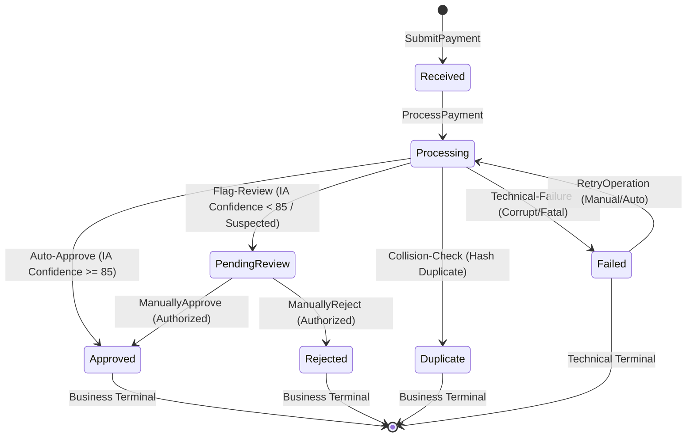
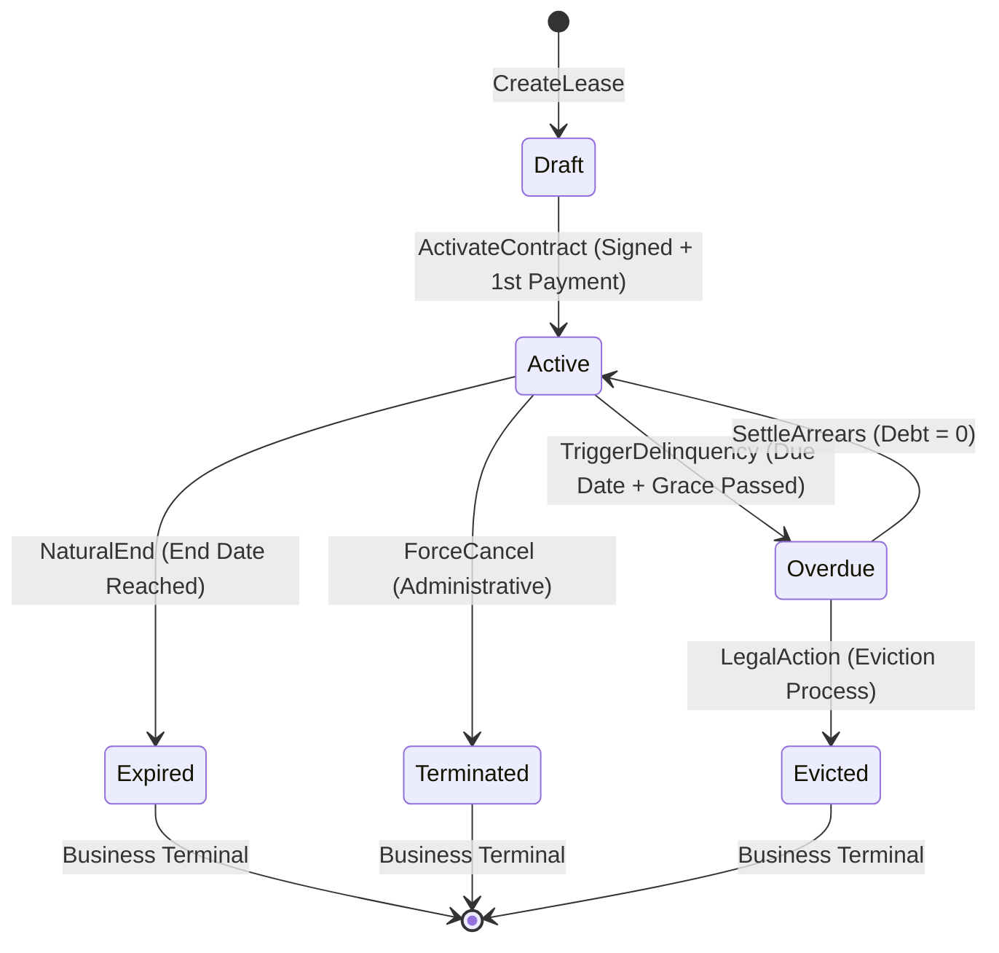
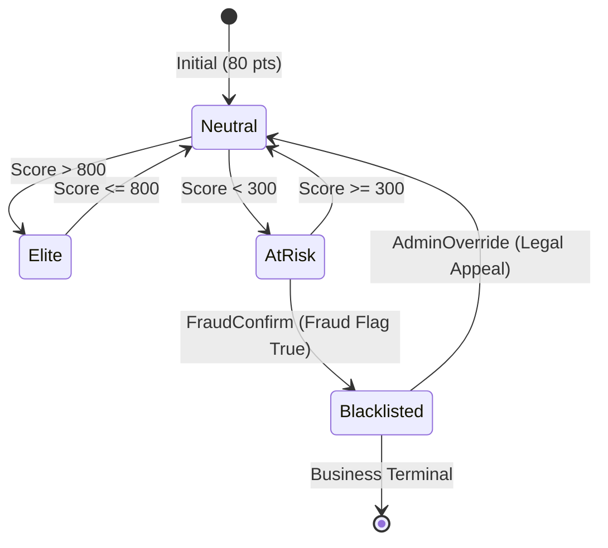
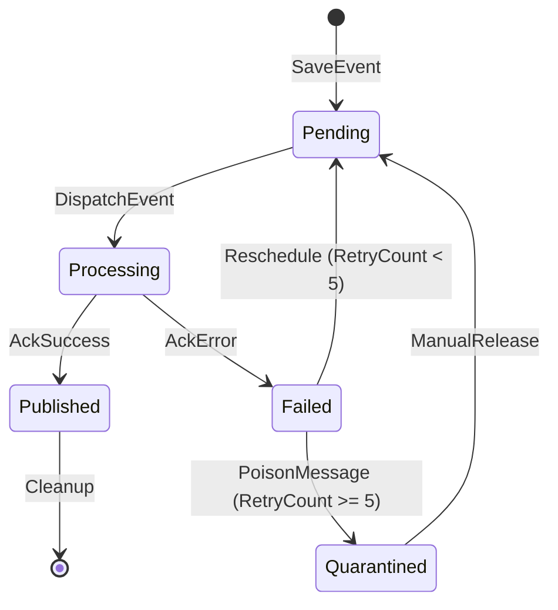

# 📘 State Machine Specification — RentGuard AI (Enterprise Edition)

Esta especificación define el comportamiento dinámico de los agregados mediante Máquinas de Estado Finitas (FSM). Garantiza que toda transición sea válida, auditada y protegida contra colisiones de concurrencia.

---

## 1. Payment State Machine (Aggregate: Payment)

### 1.1 Diagrama de Estados

### 1.2 Tabla de Comandos y Efectos
| Comando | Estado Origen | Estado Destino | Guardas (Pre-condición) | Side Effects (Eventos) |
| :--- | :--- | :--- | :--- | :--- |
| `SubmitPayment` | `[*]` | `Received` | Payload Valid | `PaymentReceivedEvent` |
| `ProcessPayment` | `Received` | `Processing` | - | `ProcessingStartedEvent` |
| `AutoApprove` | `Processing` | `Approved` | Confidence >= 85% | `PaymentApprovedEvent` |
| `ManuallyApprove`| `PendingReview` | `Approved` | Landlord Auth | `PaymentApprovedEvent` |
| `RetryOperation` | `Failed` | `Processing` | RetryCount < 5 | `RetryInitiatedEvent` |

---

## 2. Lease State Machine (Aggregate: Lease)

### 2.1 Diagrama de Estados

### 2.2 Tabla de Comandos y Efectos
| Comando | Estado Origen | Estado Destino | Guardas (Pre-condición) | Side Effects (Eventos) |
| :--- | :--- | :--- | :--- | :--- |
| `ActivateContract`| `Draft` | `Active` | IsSigned AND FirstPayApproved | `LeaseActivatedEvent` |
| `SettleArrears` | `Overdue` | `Active` | BalanceDue <= Margin | `LeaseRestoredEvent` |
| `ForceCancel` | `Active` | `Terminated` | Admin Auth + Justification | `LeaseTerminatedEvent` |

---

## 3. TrustScore State Machine (Aggregate: Resident)

### 3.1 Diagrama de Estados

---

## 4. Outbox Message State Machine (Infra)

### 4.1 Diagrama de Estados

---

## 5. Reglas de Ejecución Enterprise

### 5.1 Concurrencia (Optimistic Locking)
- **Regla FSM-01**: Toda transición de estado DEBE verificar el `RowVersion` de la entidad. Si un comando intenta transicionar un estado que ya no es el actual (race condition entre Landlords), se lanza `DbUpdateConcurrencyException`.

### 5.2 Idempotencia de Comandos
- **Regla FSM-02**: Los comandos deben ser idempotentes. Si se recibe un comando `ApprovePayment` para un pago ya `Approved`, el sistema retorna éxito sin realizar cambios (No-Op), en lugar de error.

### 5.3 Terminalidad Distinguida
- **Business Terminal**: Estados que representan el fin de un flujo de negocio exitoso o fallido (Approved, Rejected, Expired).
- **Technical Terminal**: Estados que representan un bloqueo insuperable por el sistema automático (Failed, DeadLetter), requiriendo intervención humana.
