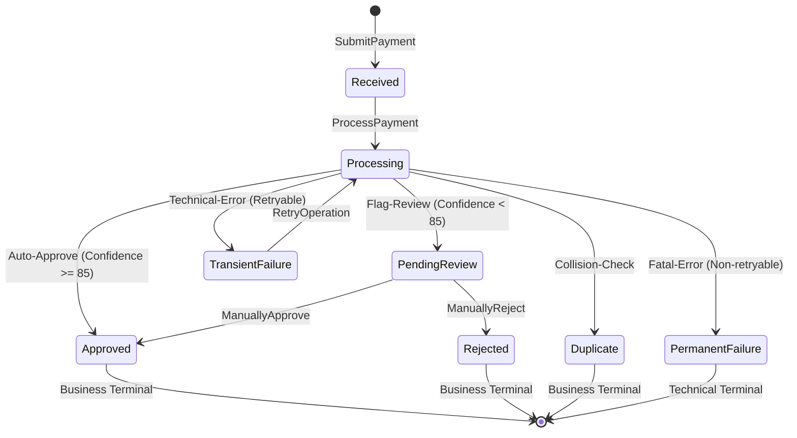
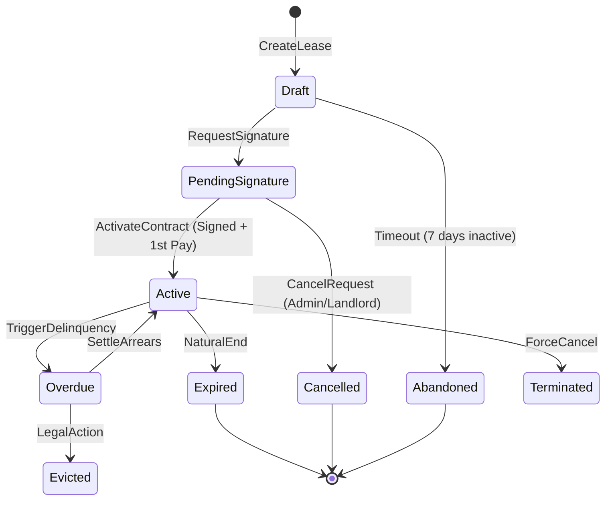
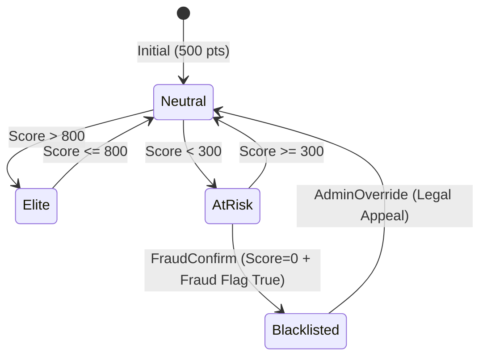
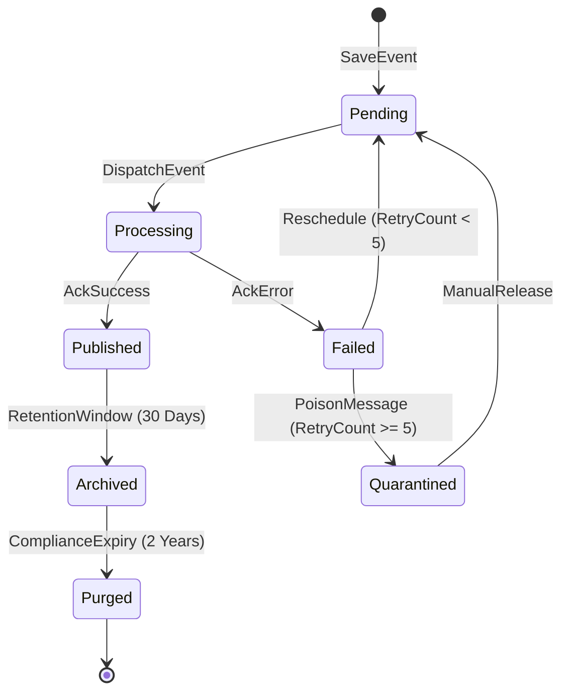

# 📘 State Machine Specification — RentGuard AI (Enterprise Edition)

Esta especificación define el comportamiento dinámico de los agregados mediante Máquinas de Estado Finitas (FSM). Garantiza que toda transición sea válida, auditada y protegida contra colisiones de concurrencia.

---

## Context Boundary
Este documento es la **fuente de verdad dinámica**. Define cómo cambian de estado los agregados. Se rige estrictamente por las reglas de 001. No define el esquema de los mensajes (ver 005) ni las políticas de red (ver 006), sino la lógica de transición y sus efectos secundarios.

---

## 1. Payment State Machine (Aggregate: Payment)

### 1.1 Diagrama de Estados

### 1.2 Matriz de Transiciones Inválidas
| Estado Actual | Comando | Resultado | Justificación |
| :--- | :--- | :--- | :--- |
| `Approved` | `ManuallyApprove` | **No-Op** | Idempotencia exitosa. |
| `Approved` | `ManuallyReject` | **Violation** | Intento de revertir ledger inmutable. Alerta Seguridad. |
| `Duplicate` | `RetryOperation` | **Forbidden** | Estado terminal de negocio. |
| `PermanentFailure` | `RetryOperation` | **Invalid** | Requiere nueva entidad/vínculo. |

### 1.2 Tabla de Comandos y Efectos
| Comando | Actor | Origen | Destino | Max Dur. | Side Effect |
| :--- | :--- | :--- | :--- | :--- | :--- |
| `SubmitPayment` | Resident | `[*]` | `Received` | - | `PaymentReceived` |
| `ProcessPayment` | Worker | `Received` | `Processing` | 5 min | `ProcessingStarted` |
| `AutoApprove` | System | `Processing` | `Approved` | - | `PaymentApproved` |
| `ManuallyApprove`| Landlord | `PendingReview` | `Approved` | 72h | `PaymentApproved` |
| `RetryOperation` | Worker/Admin| `TransientFailure` | `Processing`| - | `RetryInitiated` |

---

## 2. Lease State Machine (Aggregate: Lease)

### 2.1 Diagrama de Estados

### 2.2 Tabla de Comandos y Efectos
| Comando | Estado Origen | Estado Destino | Guardas (Pre-condición) | Side Effects (Eventos) |
| :--- | :--- | :--- | :--- | :--- |
| `ActivateContract`| `Draft` | `Active` | IsSigned AND FirstPayApproved | `LeaseActivatedEvent` |
| `SettleArrears` | `Overdue` | `Active` | BalanceDue <= Margin | `LeaseRestoredEvent` |
| `ForceCancel` | `Active` | `Terminated` | Admin Auth + Justification | `LeaseTerminatedEvent` |

---

## 3. TrustScore State Machine (Aggregate: Resident)

### 3.1 Diagrama de Estados

---

## 4. Outbox Message State Machine (Infra)

### 4.1 Diagrama de Estados

---

## 5. Reglas de Ejecución Enterprise

### 5.1 Concurrencia (Optimistic Locking)
- **Regla FSM-01**: Toda transición de estado DEBE verificar el `RowVersion` de la entidad. Si un comando intenta transicionar un estado que ya no es el actual (race condition entre Landlords), se lanza `DbUpdateConcurrencyException`.

### 5.2 Idempotencia de Comandos
- **Regla FSM-02**: Los comandos deben ser idempotentes. Si se recibe un comando `ApprovePayment` para un pago ya `Approved`, el sistema retorna éxito sin realizar cambios (No-Op), en lugar de error.

### 5.3 Terminalidad Distinguida
- **Business Terminal**: Estados que representan el fin de un flujo de negocio exitoso o fallido (Approved, Rejected, Expired).
- **Technical Terminal**: Estados que representan un bloqueo insuperable por el sistema automático (Failed, Quarantined), requiriendo intervención humana.

### 5.4 Invariantes de Máquina (Machine Invariants)
- **INV-FSM-01 (Payments)**: Todo pago `Approved` debe poseer montos, fechas e identificadores de contrato inmutables.
- **INV-FSM-02 (TrustScore)**: El historial de cambios de reputación es de tipo **Append-only**. No se permite la edición de entradas históricas.
- **INV-FSM-03 (Lease)**: Una propiedad solo puede tener un contrato en estado `Active` o `Overdue` al mismo tiempo.
- **INV-FSM-04 (Outbox)**: Un mensaje solo puede ser archivado (`Archived`) si su estado previo fue `Published`.

### 5.5 Transactional Boundaries & Side Effects
- **Rule TX-01**: Todo evento de dominio (`Side Effect`) debe ser persistido en la misma transacción física que el cambio de estado (Outbox Pattern).
- **Rule TX-02**: El despacho del evento ocurre **después** del commit exitoso. Si el worker falla tras el commit pero antes del publish, el Outbox garantiza el reintento.

### 5.6 Outbox Lock Semantics
- **LockDuration**: 30 segundos (configurable).
- **Heartbeat**: El worker debe renovar el lock si el procesamiento excede los 20s.
- **Zombie Cleanup**: Mensajes con lock expirado > 1 min se marcan automáticamente como `Pending`.

### 5.7 FSM Versioning Strategy
- **Rule V-01**: Los estados se almacenan como `string` o `integer` con mapeo inmutable.
- **Rule V-02**: Si una transición cambia drásticamente, se debe crear un nuevo `FlowVersion`. Las entidades existentes siguen su flujo original hasta terminalidad o migración forzada.

### 5.8 TrustScore: Score vs HealthTier
- El `TrustScore` [0-1000] es el estado persistido real.
- El `HealthTier` (Elite, AtRisk, Neutral) es una **Proyección** calculada en tiempo de lectura. La FSM de Reputación gobierna el valor numérico; la UI gobierna la categoría visual.
