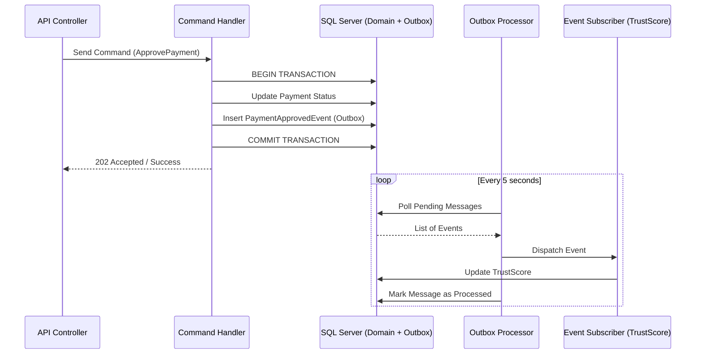

# 📘 Event Flow Architecture — RentGuard AI

Esta especificación describe la implementación de **CQRS (Command Query Responsibility Segregation)** y el flujo de eventos distribuidos en RentGuard AI, garantizando el desacoplamiento entre módulos y la escalabilidad del sistema.

---

## 1. Patrón CQRS

RentGuard AI segrega las operaciones de escritura (Comandos) de las de lectura (Consultas) para optimizar la performance y la seguridad de los datos.

### 1.1 Command Side (Escritura)
- **Responsabilidad**: Ejecutar lógica de negocio, validar invariantes y persistir cambios.
- **Flujo**:
    1. La API recibe un comando (ej. `CreatePayment`).
    2. El **Command Handler** coordina el Dominio.
    3. Se persiste el cambio en la DB + se guarda el evento en el **Outbox** (Misma Transacción).
- **Consistencia**: Fuerte.

### 1.2 Query Side (Lectura)
- **Responsabilidad**: Retornar datos optimizados para la UI (DTOs).
- **Flujo**:
    1. La API recibe una consulta (ej. `GetPaymentHistory`).
    2. Se utiliza **Dapper** o **EF Core (AsNoTracking)** para consultar proyecciones o tablas de estado.
- **Consistencia**: Eventual (en lecturas que dependan de procesos asíncronos).

---

## 2. Ciclo de Vida del Evento Distribuido

El sistema utiliza eventos para comunicar cambios entre módulos (ej. de Pagos a TrustScore).

---

## 3. Flujos de Eventos Críticos

### 3.1 Flujo de Aprobación de Pago y Reputación
1. **Origen**: `PaymentApprovedEvent` (Módulo de Pagos).
2. **Destino**: `PaymentApprovedEventHandler` (Módulo de TrustScore).
3. **Acción**: Actualización de puntos del inquilino basada en la fecha de pago vs vencimiento.

### 3.2 Flujo de Fraude Detectado
1. **Origen**: `FraudDetectedEvent` (Módulo de IA/Validación).
2. **Destino**: `SecurityHandler` y `NotificationHandler`.
3. **Acción**: Bloqueo preventivo de la cuenta del inquilino y notificación inmediata al Landlord.

---

## 4. Idempotencia y Resiliencia

Para manejar la naturaleza "At-least-once" de la entrega de eventos:
- **Consumer Idempotency**: Los suscriptores verifican si el `EventId` ya ha sido procesado antes de ejecutar la lógica.
- **Transactional Integrity**: Si un suscriptor falla, el Worker no marca el mensaje como procesado, permitiendo el reintento automático (Exponential Backoff).
