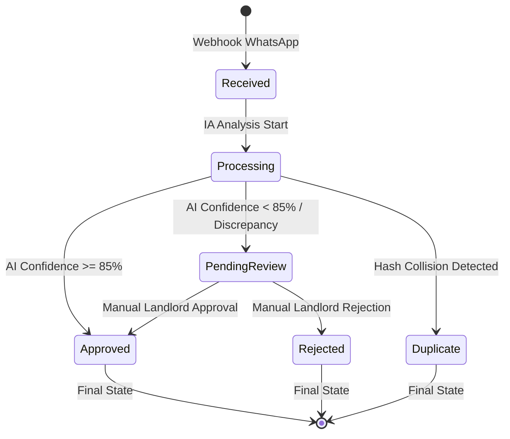
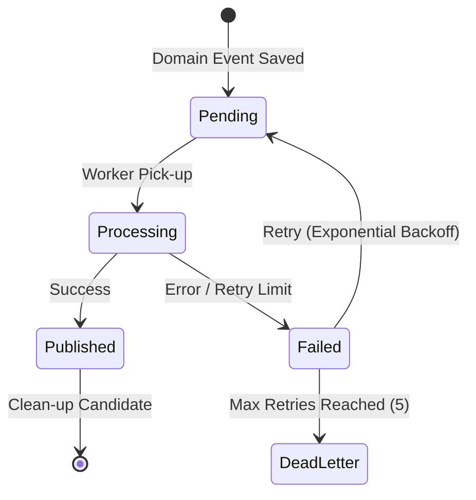
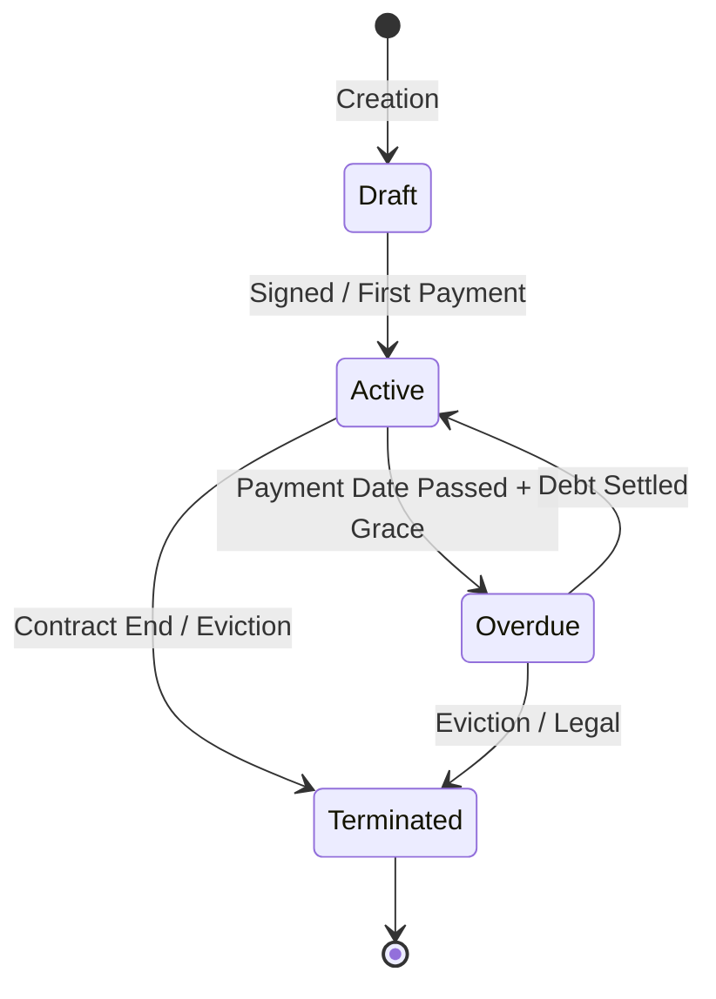
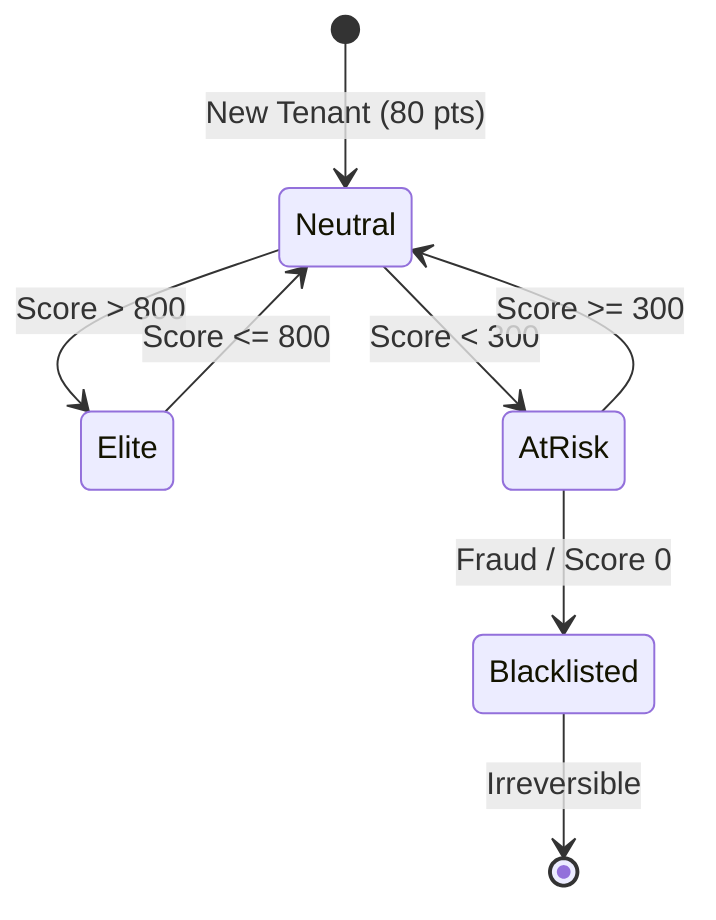

# 📘 State Machine Specification — RentGuard AI

Esta especificación define las máquinas de estado finitas (FSM) para las entidades críticas del sistema. El objetivo es prevenir estados inválidos y transiciones ilegales que puedan comprometer la integridad financiera o reputacional.

---

## 1. Payment State Machine

La gestión de pagos es el flujo más crítico. Los estados aseguran que un comprobante pase por validación de IA y humana antes de impactar el TrustScore.

### Reglas de Transición (Payment)
- **Approved** y **Rejected** son estados terminales (inmutables).
- Un pago solo puede llegar a **Approved** desde `Processing` (automático) o `PendingReview` (manual).
- El estado **Duplicate** bloquea cualquier procesamiento posterior de TrustScore.

---

## 2. Outbox Message State Machine

Garantiza la consistencia eventual y la entrega "at-least-once" de eventos de dominio.

### Reglas de Transición (Outbox)
- **DeadLetter** requiere intervención manual del administrador para re-encolar o descartar.
- El Worker solo selecciona mensajes en estado `Pending` o `Failed` (con tiempo de espera).

---

## 3. Lease State Machine (Contratos)

Define el ciclo de vida del arrendamiento y la vinculación propiedad-inquilino.

### Reglas de Transición (Lease)
- Un contrato **Terminated** libera la propiedad para un nuevo `Draft`.
- El paso a **Overdue** es un proceso automático disparado por el sistema de monitoreo diario.

---

## 4. TrustScore Status (Reputación)

Aunque el score es un valor numérico, su "salud" se categoriza para triggers de UX.

### Reglas de Transición (TrustScore)
- **Blacklisted** es un estado administrativo que impide la creación de nuevos contratos en cualquier propiedad del sistema.
- Las transiciones de salud disparan notificaciones específicas vía WhatsApp (ej. Felicitaciones por nivel Elite).
